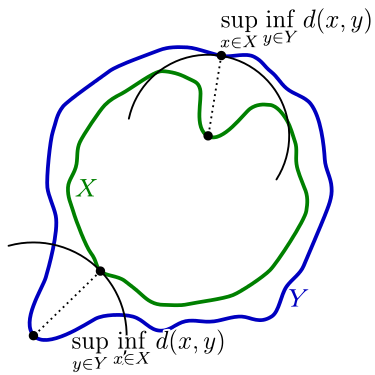
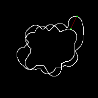
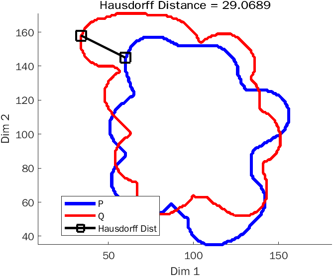

# Hausdorff distance calculation using Matlab



> In mathematics, the **Hausdorff distance**, or **Hausdorff metric**, also called **Pompeiu–Hausdorff distance**, measures how far two [subsets](https://en.wikipedia.org/wiki/Subset) of a [metric space](https://en.wikipedia.org/wiki/Metric_space) are from each other.
>Informally, two sets are close in the Hausdorff distance if every point of either set is close to some point of the other set. The Hausdorff distance is the longest distance you can be forced to travel by an adversary who chooses a point in one of the two sets, from where you then must travel to the other set. In other words, it is the greatest of all the distances from a point in one set to the closest point in the other set. [Wikipedia]

## Problem statement:

Implement the Hausdorff distance and test for the images given in folder named "images".
Choose one image as a test and measure the distances with the other images. Sample result images are shown in image1_2 and image3_4.

**Input images:** image1 ... image4

Example:

<table>
  <tr>
    <td>
 <p>
Image 1</td>
    <td>
  <p>
Image 2</td>
    <td>
  <p>
Resultant HD distance</td>
  </tr>
</table>


## Code:

```Matlab
function [ H ] = hausdorffDist(P,Q)
   D = pdist2(P,Q); % Distance calculation
   hab = max(min(D,[],2));% Directed from a to b
   hba = max(min(D));% Directed from b to a
   H = max([hab,hba]);
end
```

## Results (Output):




## REFERENCES:

* Hausdorff distance, From Wikipedia, the free encyclopedia.

* Hausdorff Distance, version 1.6.0.0 (4.22 KB) by Zachary Danziger [[Link](https://in.mathworks.com/matlabcentral/fileexchange/26738-hausdorff-distance)]

* Distance Measures - Part 5: Hausdroff Distance & Edit Distance by Dr. Surya Prakash [[Link](https://www.youtube.com/watch?v=cmzL8b5Z7CY)]

